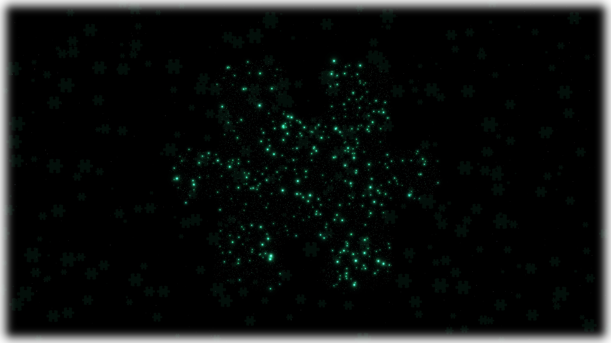

<h1 align="center" id="расширения-gnome">Расширения GNOME</h1>

---

Этот репозиторий является подборкой расширений для [рабочей среды GNOME](https://www.gnome.org/). Автор подборки: [Muralmaks IT](https://youtube.com/@muralmaksit).

**Предоставленные ниже расширения были проверены на GNOME 50 *(Fedora 44)* в сентябре 2026 года.**

<h3 align="center">Посмотреть вживую на плагины не скачивая их можно в видео ниже</h3>

---
> [!WARNING]
> **НЕ СТАВЬТЕ СРАЗУ ВСЕ ПЛАГИНЫ ИЗ ЭТОГО СПИСКА!** Некоторые попросту будут конфликтовать друг с другом. **Поэтому выберите для себя только те, которые действительно будут вам полезны.**
---
### Этот список есть и в других местах!
- Telegram: https://t.me/muralmaksit/1350
- Блог: https://blog.cat8753.ru/blog/gnomeExtensions
---

## Оглавление
1. [**Кастомизация внешнего вида**](#кастомизация-внешнего-вида)
    - [Тема, иконки, цвета](#тема-иконки-цвета)
    - [Обои и рабочий стол](#обои-и-рабочий-стол)
    - [Панель, Уведомления и Центр управления](#панель-уведомления-и-центр-управления)
    - [Я у мамы macOS](#я-у-мамы-macos)
    - [Экран блокировки](#экран-блокировки)
    - [Вот кому-то делать не███](#вот-кому-то-делать-не)
2. [**Продуктивность**](#продуктивность)
    - [Заметки, задачи, тайм-менеджмент](#заметки-задачи-тайм-менеджмент)
    - [Буфер обмена, скриншоты, OCR, рисование](#буфер-обмена-скриншоты-ocr-рисование)
    - [Медиа](#медиа)
    - [Поиск и запуск приложений](#поиск-и-запуск-приложений)
    - [Полезное](#полезное)
3. [**Управление окнами и рабочими столами**](#управление-окнами-и-рабочими-столами)
    - [Тайлинг окон](#тайлинг-окон)
    - [Alt-Tab, фокус, переключение](#alt-tab-фокус-переключение)
    - [Рабочие столы](#рабочие-столы)
    - [Прочее управление окнами](#прочее-управление-окнами)
4. [**Системный мониторинг и администрирование**](#системный-мониторинг-и-администрирование)
    - [Батарея и питание](#батарея-и-питание)
    - [Системные ресурсы](#системные-ресурсы)
    - [Сеть, серверы, порты, SSH](#сеть-серверы-порты-ssh)
5. [**Оборудование и подключения**](#оборудование-и-подключения)

---

## Кастомизация внешнего вида
### Тема, иконки, цвета
- [Just Perfection](https://extensions.gnome.org/extension/3843/just-perfection/) - Позволяет настроить каждый элемент в гноме.
- [Gnome 4x, 5x UI Improvements](https://extensions.gnome.org/extension/4158/gnome-40-ui-improvements/) - Твикер по большей части экрана обзора.
- [Essential Tweaks](https://extensions.gnome.org/extension/8928/essential-tweaks/) - Позволяет добавить закругления панели и экрана, а также убирает пару надоедливых вещей.
- [User style sheet](https://extensions.gnome.org/extension/3414/user-stylesheet-font/) - Позволяет манипулировать внешним видом гнома при помощи пользовательского CSS-файла.
- [User Themes](https://extensions.gnome.org/extension/19/user-themes/) - Позволяет применять сторонние темы в гноме.
- [Blur my Shell](https://extensions.gnome.org/extension/3193/blur-my-shell/) - Добавляет на элементы интерфейса блюр на основе обоев.
- [Tint my Shell](https://extensions.gnome.org/extension/8906/tinted-shell/) - Перекрашивает элементы интерфейса под акцентный цвет.
- [Auto Accent Colour](https://extensions.gnome.org/extension/7502/auto-accent-colour/) - Акцентный цвет выбирается на основе цвета ваших обоев.
- [Icon Theme Switcher](https://extensions.gnome.org/extension/9206/icon-theme-switcher/) - Позволяет быстро менять набор иконок и акцентный цвет прямо из верхней панели.
- [ColorTint](https://extensions.gnome.org/extension/1789/colortint/) - Красит экран выбранным вами цветом.
- [AppGrid Fit](https://extensions.gnome.org/extension/9933/app-grid-icon-size/) - Позволяет настраивать сетку в меню приложений.
- [Vertical App Grid](https://extensions.gnome.org/extension/9059/vertical-app-grid/) - Превращает меню приложений в вертикальный список.
- [Category sorted App Grid](https://extensions.gnome.org/extension/8252/category-sorted-app-grid/) - Располагает приложения в меню по категориям.
- [App Grid Wizard](https://extensions.gnome.org/extension/7867/app-grid-wizard/) - Группирует приложения в меню по папкам.
- [App Hider](https://extensions.gnome.org/extension/5895/app-hider/) - Скрывает приложение из меню приложений.
- [Show Apps Animation](https://extensions.gnome.org/extension/9583/show-apps-animation/) - Добавляет анимацию подпрыгивания иконки при запуске приложения.
- [Nonlinear animation is all you need](https://extensions.gnome.org/extension/10649/nonlinear-animation-is-all-you-need/) - Позволяет менять кривую всех анимаций.
- [Burn My Windows](https://extensions.gnome.org/extension/4679/burn-my-windows/) - Кучу анимаций открытия и закрытия окна.
- [P7 Borders](https://extensions.gnome.org/extension/9064/p7-window-borders/) - Добавляет контур к окнам. Но увы, не ко всем.
- [Window Gap](https://extensions.gnome.org/extension/10450/window-gap/) - Добавляет отступ от краев у максимизированного окна.
- [Overview Privacy](https://extensions.gnome.org/extension/10702/overview-privacy/) - Скрывает содержимое выбранного приложения в обзоре.
- [Disable Screenshot Flash and Sound](https://extensions.gnome.org/extension/10009/disable-screenshot-flash-and-sound/) - Убирает гномовский эффект скриншота.
- [OLED Panel Shift](https://extensions.gnome.org/extension/9575/oled-panel-shift/) - Передвигает содержимое контента панели на пару пикселей через определенный интервал. Таким образом плагин немного замедляет выгорание пикселей на OLED-экранах.

### Обои и рабочий стол
- [Desktop Icons NG](https://extensions.gnome.org/extension/2087/desktop-icons-ng-ding/) - Добавляет иконки на рабочий стол. Если вы активно пользовались рабочим столом в Ubuntu, то этот плагин явно для вас.
- [Desktop Widgets](https://extensions.gnome.org/extension/9071/desktop-widgets/) - Гибкий плагин с виджетами даты, времени и текста.
- [Picture Desktop Widget Remake](https://extensions.gnome.org/extension/10608/picture-desktop-widget-remake/) - Виджет-слайдшоу из выбранных вами картинок.
- [Wallpaper Slideshow](https://extensions.gnome.org/extension/6281/wallpaper-slideshow/) - Слайд-шоу обоев.
- [Wallshuffle](https://extensions.gnome.org/extension/10449/wallshuffle/) - Ставит разные обои на другие мониторы.
- [Static Workspace Background](https://extensions.gnome.org/extension/8505/static-workspace-background/) - Убирает анимацию перемещения обоев при переключении на другой рабочий стол.
- [Add to Desktop](https://extensions.gnome.org/extension/3240/add-to-desktop/) - Позволяет добавлять приложения на рабочий стол прямо из меню приложений, одним кликом.

### Панель, Уведомления и Центр управления
- [Tweaks & Extensions in System Menu](https://extensions.gnome.org/extension/1653/tweaks-in-system-menu/) - Добавляет кнопки GNOME Tweaks и Менеджера расширений в центре управления.
- [Top Bar Organizer](https://extensions.gnome.org/extension/4356/top-bar-organizer/) - Позволяет менять расположение элементов на верхней панели.
- [Disable Menu Switching](https://extensions.gnome.org/extension/4133/disable-menu-switching/) - Отключает переключение меню при наведении на другой элемент в панели.
- [Notification Banner Position](https://extensions.gnome.org/extension/4105/notification-banner-position/) - Позволяет настроить расположение уведомлений.
- [Notification Timeout](https://extensions.gnome.org/extension/3795/notification-timeout/) - Позволяет задать пользовательское время скрытия для всех уведомлений.
- [Junk Notification Cleaner](https://extensions.gnome.org/extension/8230/junk-notification-cleaner/) - Чистит уведомления от приложения, которое завершило свой процесс, или наоборот, в фокусе.
- [Top Panel Notification Icons Revived](https://extensions.gnome.org/extension/6248/top-panel-notification-icons-revived/) - Отображает иконки уведомлений на верхней панели.
- [Notifications Alert](https://extensions.gnome.org/extension/258/notifications-alert-on-user-menu/) - С этим плагином при новом непрочитанном уведомлении часы начнут мигать.
- [Privacy Quick Settings](https://extensions.gnome.org/extension/4491/privacy-settings-menu/) - Добавляет быстрый доступ к отключению местоположения, камеры и микрофона в центре управления.
- [Resolution and Refresh Rate in Quick Settings](https://extensions.gnome.org/extension/7183/resolution-and-refresh-rate-in-quick-settings/) - Добавляет настройки монитора в центре управления.
- [Slider Percentages](https://extensions.gnome.org/extension/10125/slider-percentages/) - Добавляет процентное значение ко множеству слайдеров гнома.
- [Sound percentage](https://extensions.gnome.org/extension/7426/sound-percentage/) - Добавляет процентное значение громкости на верхней панели.
- [Quick Settings Audio Devices Renamer](https://extensions.gnome.org/extension/6000/quick-settings-audio-devices-renamer/) - Позволяет менять названия звуковых устройств в центре управления на свои.
- [Flags Input Indicator](https://extensions.gnome.org/extension/10290/flags-input-indicator/) - Меняет символы в индикаторе раскладки на флаги.
- [Uppercase Input Source Indicator](https://extensions.gnome.org/extension/8672/uppercase-input-source-indicator/) - Меняет символы в индикаторе раскладки на заглавные.
- [Keyboard Informer](https://extensions.gnome.org/extension/8500/keyboard-informer/) - Отображает какие клавиши-модификаторы зажаты в данный момент, а также оповещает об активированном Caps Lock, Num Lock и Scroll Lock.
- [Lock Keys](https://extensions.gnome.org/extension/36/lock-keys/) - Просто отображает состояние Caps Lock и Num Lock в верхней панели.
- [App Name Indicator](https://extensions.gnome.org/extension/8667/app-name-indicator/) - Добавляет название и иконку активного окна в верхнюю панель.
- [Simple Message](https://extensions.gnome.org/extension/5018/simple-message/) - Просто сообщение на панели. Он ещё команды при нажатии выполняет, кстати.
- [Weather or Not](https://extensions.gnome.org/extension/5660/weather-or-not/) - Показывает текущую погоду в верхней панели.
- [Clock Weather Switch](https://extensions.gnome.org/extension/9076/clock-weather-switch/) - Чередует показ времени и погоды с определенным интервалом.
- [Peek Top Bar on Fullscreen](https://extensions.gnome.org/extension/6048/peek-top-bar-on-fullscreen/) - Показывает верхнюю панель при наведении в полноэкранном режиме.
- [Dash in Panel](https://extensions.gnome.org/extension/7855/dash-in-panel/) - Пихает дэш в верхнюю панель.
- [Avatar Quick Settings](https://extensions.gnome.org/extension/10617/avatar-quick-settings/) - Добавляет имя пользователя и его аватарку в центре управления.
- [User Avatar In Quick Settings](https://extensions.gnome.org/extension/5506/user-avatar-in-quick-settings/) - Добавляет только аватарку.
- [Frippery Applications Menu](https://extensions.gnome.org/extension/13/applications-menu/) - Добавляет простенькое меню приложений вместо кнопки активностей.
- [Looking Glass Button](https://extensions.gnome.org/extension/2296/looking-glass-button/) - Добавляет кнопку быстрого вызова [Looking Glass](https://gitlab.gnome.org/GNOME/gnome-shell/-/blob/main/docs/looking-glass.md) в верхнюю панель.
- [Extension List](https://extensions.gnome.org/extension/3088/extension-list/) - Позволяет управлять расширениями прямо с верхней панели.
- [Extension Profiles](https://extensions.gnome.org/extension/9545/extension-profiles/) - Добавляет профили для плагинов. Можно создать несколько профилей и в каждом включать те или иные расширения.
- [Fedora Linux Update Indicator](https://extensions.gnome.org/extension/6406/fedora-linux-update-indicator/) - Показывает количество доступных обновлений для Fedora в верхней панели. Есть такой же плагин и для [Arch](https://extensions.gnome.org/extension/1010/archlinux-updates-indicator/).
- [AppIndicator and KStatusNotifierItem Support](https://extensions.gnome.org/extension/615/appindicator-support/) - Добавляет совместимость с разными протоколами индикаторов приложений.
- [Color Picker](https://extensions.gnome.org/extension/3396/color-picker/) - Пипетка с историей прямо в верхней панели.

### Я у мамы macOS
- [Logo Menu](https://extensions.gnome.org/extension/4451/logo-menu/) - Добавляет а-ля macOS меню в верхнюю панель.
- [Username Avatar Top Menu](https://extensions.gnome.org/extension/9551/username-avatar-top-menu/) - Отображает аватарку, имя пользователя, хост и прочую информацию в верхней панели.
- [Kiwi Menu](https://extensions.gnome.org/extension/8697/kiwi-menu/) - Чуть покруче Logo Menu.
- [Kiwi (is not Apple)](https://extensions.gnome.org/extension/8276/kiwi-is-not-apple/) - Добавляет кучу твиков, чтобы гном был похож на macOS.
- [WACK - Sonoma Lockscreen](https://extensions.gnome.org/extension/9713/wack-sonoma-lockscreen/) - Добавляет новый стиль экрана блокировки, вдохновленный дизайном macOS.
- [Stage Manager](https://extensions.gnome.org/extension/9528/stage-manager/) - Добавляет Stage Manager из macOS.
- [Dash to Dock](https://extensions.gnome.org/extension/307/dash-to-dock/) - Превращает дэш в док.
- [Dash to Panel](https://extensions.gnome.org/extension/1160/dash-to-panel/) - Превращает дэш в панель, чтобы быть более похожим на Windows. *(не спрашивайте что он в этой подкатегории забыл)*

### Экран блокировки
- [Analog Lock Clock](https://extensions.gnome.org/extension/9784/analog-lock-clock/) - Добавляет красивые и гибкие аналоговые часы на экран блокировки.
- [Live Lock Screen](https://extensions.gnome.org/extension/9419/live-lock-screen/) - Позволяет ставить живые обои на экран блокировки.
- [Lock screen background](https://extensions.gnome.org/extension/1476/unlock-dialog-background/) - Позволяет ставить другие обои на экран блокировки.
- [Customize Clock on Lock Screen](https://extensions.gnome.org/extension/4663/customize-clock-on-lock-screen/) - Добавляет гибкую настройку часов на экране блокировки.

### Вот кому-то делать не███
- [Desktop Cube](https://extensions.gnome.org/extension/4648/desktop-cube/) - Добавляет 3D-эффект обзору рабочих столов.
- [Compiz windows effect](https://extensions.gnome.org/extension/3210/compiz-windows-effect/) - Желейное окно.
- [DINKIssTyle 3D Wins](https://extensions.gnome.org/extension/9804/dinkisstyle-3d-wins/) - Я не знаю как это описать, поэтому вот вам ссылка.
- [Activate Linux](https://extensions.gnome.org/extension/9477/activate-linux/) - **Пришло время активировать Linux!**

## Продуктивность
### Заметки, задачи, тайм-менеджмент
- [NoteDock](https://extensions.gnome.org/extension/10548/notedock/) - Простенькие заметки в верхней панели.
- [Cronomix](https://extensions.gnome.org/extension/6003/cronomix/) - Плагин 6 в 1: Секундомер, таймер, помодоро, будильник, тудушник и карточки.
- [Break Reminder](https://extensions.gnome.org/extension/9767/movement-break-reminder/) - Напоминает о перерыве на разминку.
- [Water Reminder](https://extensions.gnome.org/extension/9484/water-reminder/) - Напоминает тебе попить воды.
- [Screen Time](https://extensions.gnome.org/extension/10586/screen-time/) - Экранное время с подробной статистикой.
- [Timezone](https://extensions.gnome.org/extension/1060/timezone/) - Просмотр времени ваших друзей прямо в верхней панели.
- [Next Up 2](https://extensions.gnome.org/extension/9194/next-up-2/) - Показывает текущее или следующее событие календаря в верхней панели.

### Буфер обмена, скриншоты, OCR, рисование
- [Copyous](https://extensions.gnome.org/extension/8834/copyous/) - Самый лучший буфер обмена для гнома. Удобный интерфейс, автоматическое определение типа содержимого, подсветка кода, а также кучу других фишек. И всё это с гибкими настройками!
- [Emoji Copy](https://extensions.gnome.org/extension/6242/emoji-copy/) - Быстрый доступ к эмодзи. Либо кнопкой в верхней панели, либо комбинацией клавиш.
- [Shotzy](https://extensions.gnome.org/extension/9707/shotzy/) - Добавляет в GNOME Screenshot функции распознавания текста, QR-кода, а также поиск области экрана в Google.
- [Draw On Gnome](https://extensions.gnome.org/extension/7921/draw-on-gnome/) - Рисуй прямо на своем экране! Полезен для презентаций или визуального объяснения чего-либо.
- [Hati Cursor Highlighter](https://extensions.gnome.org/extension/9209/hati-cursor-highlighter/) - Красивая обводка курсора. С лупой и гибкими настройками.
- [Smooth Zoom](https://extensions.gnome.org/extension/10044/smooth-zoom/) - Лупа при определенной комбинации клавиш.
- [DePerto (Zoom by Scroll)](https://extensions.gnome.org/extension/9256/deperto-zoom-by-scroll/) - Ещё одна лупа, но тут ты уже можешь колесиком мышки задать процент приближения.

### Медиа
- [Advanced Media Controller](https://extensions.gnome.org/extension/9184/advanced-media-controller/) - Красивый, удобный и гибкий медиа-контроллер прямо в верхней панели. 
- [Smart Pause & Resume](https://extensions.gnome.org/extension/9167/smart-pause-resume/) - Автоматически ставит на паузу предыдущий источник медиа, если появился новый источник. Прямо как в Android.
- [Quick Sound Switcher](https://extensions.gnome.org/extension/9788/quick-sound-switcher/) - Добавляет настройки входа и выхода аудио в центре управления, а также позволяет настраивать громкость приложений.
- [Quick Settings Audio Panel](https://extensions.gnome.org/extension/5940/quick-settings-audio-panel/) - Плагин покруче. Настолько, что создает отдельную панель под все настройки мультимедиа.

### Поиск и запуск приложений
- [Spotlight](https://extensions.gnome.org/extension/10666/spotlight/) - Добавляет удобный поиск, который всегда под рукой.
- [DuckDuckBang](https://extensions.gnome.org/extension/8229/duckduckbang/) - Добавляет веб-поиск в гномовском поиске.
- [Transcode App Search (Fonetic)](https://extensions.gnome.org/extension/9390/transcode-app-search-fonetic/) - Позволяет искать приложения в поиске с неправильной раскладкой.
- [Layout Fixer](https://extensions.gnome.org/extension/9785/layout-fixer/) - Меняет одной комбинацией клавиш раскладку набранного слова. Жалко, что работает **только с английского** на другие раскладки.
- [ESC to close Overview](https://extensions.gnome.org/extension/9391/esc-to-close-overview/) - С этим плагином вы сможете сразу попадать на рабочий стол прямо с меню приложений, всего одним нажатием Escape, а не двумя.
- [Double Click Activities to App Grid](https://extensions.gnome.org/extension/9339/double-click-activities-to-app-grid/) - Позволяет попасть в меню приложений двойным нажатием на кнопку активностей.
- [Desktop Shortcut](https://extensions.gnome.org/extension/10271/desktop-shortcut/) - Позволяет перейти к .desktop-файлу выбранного приложения.
- [App Grid Uninstall](https://extensions.gnome.org/extension/9706/app-grid-uninstall/) - Позволяет удалять приложения прямо из меню приложений.

### Полезное
- [Action Station](https://extensions.gnome.org/extension/9466/action-station/) - Быстрый доступ к пользовательским командам и HTTP-запросам прямо в верхней панели.
- [GitHub Tray](https://extensions.gnome.org/extension/9307/github-tray/) - Ваш профиль, уведомления и репозитории Github в верхней панели.
- [Browser Switcher](https://extensions.gnome.org/extension/8836/browser-switcher/) - Быстрый доступ к настройке браузера по умолчанию в верхней панели.
- [Caffeine](https://extensions.gnome.org/extension/517/caffeine/) - Режим, который отключает скринсейверы и автоматический переход в режим ожидания.
- [Quick Exit](https://extensions.gnome.org/extension/10744/quick-exit/) - Уменьшает время автоматического завершения работы или перезагрузки ПК.
- [In Picture](https://extensions.gnome.org/extension/8692/in-picture/) - Настройка окон типа “Картинка в картинке”.

## Управление окнами и рабочими столами
### Тайлинг окон
- [Smart Tiling](https://extensions.gnome.org/extension/8791/smart-tiling/) - Добавляет тайлинг из Windows.
- [Tiling Shell](https://extensions.gnome.org/extension/7065/tiling-shell/) - Плагин покруче предыдущего. Добавляет макеты размещения окон, "Snap Assistant" из Windows 11 и многое другое.
- [Awesome Tiles](https://extensions.gnome.org/extension/4702/awesome-tiles/) - Быстрое размещение окна в 9-и расположениях при помощи нампада.
- [PaperWM](https://extensions.gnome.org/extension/6099/paperwm/) - Меняет концепцию тайлинга окон целиком. *(Наподобие [Niri](https://github.com/niri-wm/niri))*

### Alt-Tab, фокус, переключение
- [Coverflow Alt-Tab](https://extensions.gnome.org/extension/97/coverflow-alt-tab/) - Добавляет красивый вид Alt-Tab.
- [Focus on Active Window](https://extensions.gnome.org/extension/9037/focus-on-active-window/) - Добавляет визуальное выделение активного окна. А остальные окна тем временем становятся прозрачными.
- [Focus changer](https://extensions.gnome.org/extension/4627/focus-changer/) - Переключение на другое окно в зависимости от его расположения. Переключаться можно по всем четырем направлениям.
- [Focus Under Cursor on Overview Exit](https://extensions.gnome.org/extension/9578/focus-under-cursor-on-overview-exit/) - На каком окне у тебя стоял курсор в обзоре, то окно и станет активным после выхода из обзора.
- [Quick Close in Overview](https://extensions.gnome.org/extension/352/middle-click-to-close-in-overview/) - Позволяет быстро закрывать окна средней кнопкой мыши прямо в обзоре.

### Рабочие столы
- [Show Desktop Button](https://extensions.gnome.org/extension/1194/show-desktop-button/) - Добавляет кнопку показа рабочего стола в верхнюю панель.
- [Show Desktop Plus](https://extensions.gnome.org/extension/9756/show-desktop-plus/) - Плагин покруче предыдущего в плане функционала. Но, к сожалению, он не хочет размещаться в самом правом положении.
- [Workspace Number Indicator](https://extensions.gnome.org/extension/9809/workspace-number-indicator/) - Отображает номер текущего рабочего стола.
- [Workspace Bar](https://extensions.gnome.org/extension/9467/workspace-bar/) - Добавляет более удобную индикацию рабочих столов с показом открытых окон.
- [Named Workspaces](https://extensions.gnome.org/extension/9318/named-workspaces/) - Позволяет называть свои рабочие столы.
- [Default Workspace](https://extensions.gnome.org/extension/4783/default-workspace/) - Позволяет поставить определенный номер рабочего стола по умолчанию при входе в систему.

### Прочее управление окнами
- [Pin Window](https://extensions.gnome.org/extension/9878/pin-window/) - Позволяет закрепить окно, делая его всегда поверх других окон.
- [Window Dimensions](https://extensions.gnome.org/extension/9174/window-dimensions/) - Показывает размер окна при изменении этого самого размера.
- [Minimized Windows Buttons](https://extensions.gnome.org/extension/8657/minimized-windows-buttons/) - Показывает свернутые окна в виде кнопок внизу экрана.
- [Application Tabs](https://extensions.gnome.org/extension/6254/application-tabs/) - Удобное управление окнами приложения в виде вкладок.
- [Transparent Window Moving](https://extensions.gnome.org/extension/1446/transparent-window-moving/) - Перемещаемое окно становится полупрозрачным.
- [ScreenToSpace](https://extensions.gnome.org/extension/8852/screentospace/) - Максимизированное окно автоматически перемещается на новый рабочий стол.
- [Force Quit](https://extensions.gnome.org/extension/770/force-quit/) - Позволяет быстро завершить процесс приложения.
- [Dock Window Preview](https://extensions.gnome.org/extension/9492/dock-window-preview/) - Предпросмотр окон приложения в доке.

## Системный мониторинг и администрирование
### Батарея и питание
- [Battery Usage Wattmeter](https://extensions.gnome.org/extension/6278/battery-usage-wattmeter/) - Добавляет на верхнюю панель ваттметр батареи.
- [Battery Power Monitor: Watts & Time](https://extensions.gnome.org/extension/9023/batt-watt-power-monitor/) - Добавляет на верхнюю панель ваттметр, время до разрядки батареи и гибкую настройку индикации.
- [Battery time](https://extensions.gnome.org/extension/5425/battery-time/) - Просто показывает время до разрядки батареи в центре управления.
- [Power Dial](https://extensions.gnome.org/extension/8563/power-dial/) - Красивое меню управлением питания ПК. Помимо кнопки на верхней панели можно ещё поставить горячую клавишу.
- [Bring Out Submenu Of Power Off Button](https://extensions.gnome.org/extension/2917/bring-out-submenu-of-power-offlogout-button/) - Выносит все действия с питанием ПК в центр управления.
- [Restart To](https://extensions.gnome.org/extension/7215/restart-to/) - Позволяет сразу перезапуститься в другой пункт загрузочного раздела EFI.
- [RebootToUEFI](https://extensions.gnome.org/extension/5105/reboottouefi/) - Позволяет просто перезапуститься в UEFI.

### Системные ресурсы
- [Vitals](https://extensions.gnome.org/extension/1460/vitals/) - Подробный системный монитор в верхней панели.
- [system-monitor-next](https://extensions.gnome.org/extension/3010/system-monitor-next/) - Системный монитор с графиками в той же верхней панели. 
- [RunCat](https://extensions.gnome.org/extension/2986/runcat/) - Бегающий кот, скорость которого зависит от нагрузки на процессор.
- [Net speed Simplified](https://extensions.gnome.org/extension/3724/net-speed-simplified/) - Скорость интернета в верхней панели.
- [WiFi Signal Plus](https://extensions.gnome.org/extension/9329/wifi-signal-plus/) - Подробная информация о текущем Wi-Fi подключении.
- [IP Address Indicator](https://extensions.gnome.org/extension/10600/ip-address-indicator/) - Показывает ваш локальный IP-адрес в верхней панели.
- [Clean Uptime](https://extensions.gnome.org/extension/8656/clean-uptime/) - Показывает время работы операционной системы в верхней панели.

### Сеть, серверы, порты, SSH
- [Ping Bot](https://extensions.gnome.org/extension/8777/ping-bot/) - Проверка статуса сайтов прямо в верхней панели.
- [Uptime Kuma Indicator](https://extensions.gnome.org/extension/8710/uptime-kuma-indicator/) - Статусы сервисов прямиком из вашего Uptime Kuma.
- [Ports Monitor](https://extensions.gnome.org/extension/9824/ports-monitor/) - Позволяет просматривать какие порты открыты и кто их открыл.
- [SSH Watchdog](https://extensions.gnome.org/extension/9343/ssh-watchdog/) - Позволяет просматривать список подключенных к вам устройств по SSH.
- [Wake-on-LAN](https://extensions.gnome.org/extension/8239/wake-on-lan/) - Позволяет отправлять магические пакеты на другие компьютеры прямо с верхней панели.
- [Systemd Manager Neo](https://extensions.gnome.org/extension/9825/systemd-manager-neo/) - Позволяет просматривать и управлять выбранными вами сервисами Systemd в верхней панели.

## Оборудование и подключения
- [Bluetooth Battery Meter](https://extensions.gnome.org/extension/6670/bluetooth-battery-meter/) - Отображает заряд батареи Bluetooth-устройств в верхней панели. Ещё некоторыми наушниками управлять можно, кстати.
- [Custom Touchpad Gestures](https://extensions.gnome.org/extension/10046/custom-touchpad-gestures/) - Позволяет изменять действия жестов тачпада.
- [USB Notify](https://extensions.gnome.org/extension/9463/usb-notify/) - Отправляет уведомление о подключении USB-устройства.
- [Removable Drive Menu](https://extensions.gnome.org/extension/7/removable-drive-menu/) - Добавляет в верхнюю панель список извлекаемых устройств.
- [Brightness Step](https://extensions.gnome.org/extension/10663/brightness-step/) - Позволяет менять количество шагов яркости.
- [GLocalSend](https://extensions.gnome.org/extension/9632/glocalsend/) - LocalSend, интегрированный в центр управления.
- [GSConnect](https://extensions.gnome.org/extension/1319/gsconnect/) - Полноценная реализация [KDE Connect](https://kdeconnect.kde.org/) в гноме.

---

<h3 align="center"><a href="#расширения-gnome">⬆️ Наверх</a></h3>